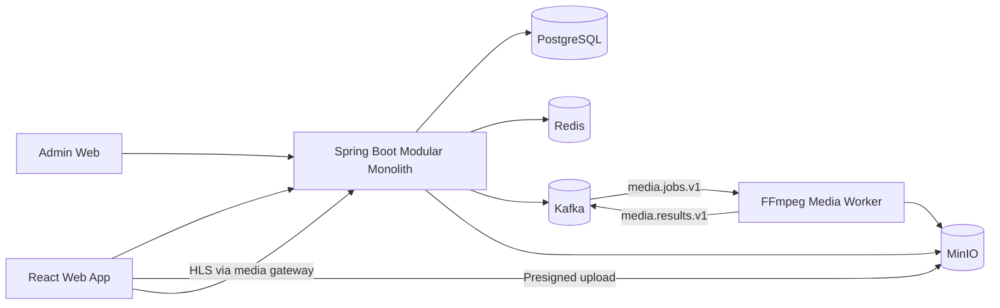
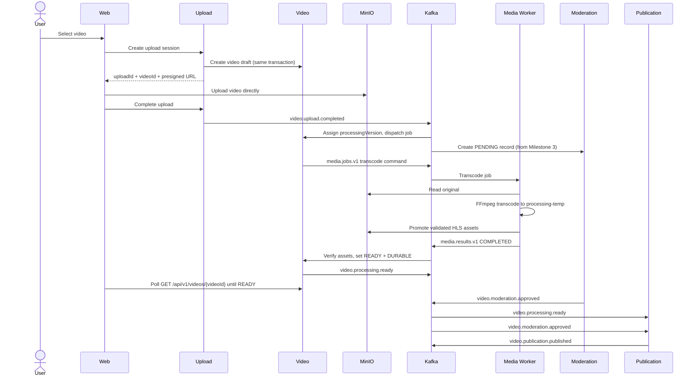

# Short-Video Platform — Local macOS Implementation Brief

Revision 3 (2026-08-23). See §27 for the change log against revisions 1 and 2.

## 1. Goal

Build a production-inspired short-video platform locally on macOS.

This is not intended to reproduce full TikTok scale on a laptop. The local version should implement the same architectural boundaries and workflows with simplified infrastructure.

The implementation should prioritize:

1. Correct domain separation
2. Clear service contracts
3. Event-driven workflows
4. Local developer experience
5. Incremental delivery
6. Testability
7. Simple migration to cloud infrastructure later

---

# 2. Implementation Strategy

Start with one local workspace repository and one Spring Boot modular monolith.
Run FFmpeg processing as one separate media worker. Do not deploy one service per
domain in the local MVP; preserve extraction seams as modules and explicit module
interfaces.

```text
short-video-platform/
├── settings.gradle.kts      # single Gradle build for backend + media-worker
├── build.gradle.kts
├── gradle.properties
├── backend/                 # Spring Boot modular monolith
├── web/                     # creator/viewer web app
├── admin-web/               # admin portal
├── contracts/               # OpenAPI and event-contract fixtures
├── media-worker/            # FFmpeg Kafka consumer (Java 21 / Spring Boot)
├── infrastructure/          # Docker Compose and local configuration
├── tests/                   # end-to-end and performance tests
└── docs/                    # architecture and operational notes
```

One Gradle build is rooted at the workspace root. The root `settings.gradle.kts`
includes `:backend:app`, every `:backend:modules:*` and `:backend:shared:*`
project, and `:media-worker`. The backend directory contains no separate
`settings.gradle.kts`.

Docker Compose and all local infrastructure configuration live in
`infrastructure/`. There is no Compose file under `backend/`.

`contracts/` holds the OpenAPI documents for every public and internal HTTP API
and the JSON fixtures for every Kafka event type. Each milestone that adds or
changes an endpoint or event updates `contracts/` in the same change, and the
build fails when a controller and its OpenAPI document disagree.

Split repositories only when separate teams, release cycles, access controls, or
technology ownership make that worthwhile.

The initial implementation may omit mobile applications.

Use the web application to test:

- registration and login
- video uploads
- feed playback
- likes and comments
- creator profiles
- moderation
- appeals
- admin workflows

---

# 3. Recommended Local Technology Stack

## Backend

```text
Java 21
Spring Boot 3
Spring MVC
Spring Data JPA
Spring Security
Gradle Kotlin DSL
REST over HTTP/JSON
OpenAPI
Resilience4j
Flyway
```

Use Spring MVC with virtual threads.

Recommended configuration:

```yaml
spring:
  threads:
    virtual:
      enabled: true
```

Do not introduce gRPC in the first version.

## Media worker

The media worker is a Java 21 Spring Boot application in the same Gradle build as
the backend, packaged and run as a separate process. It shares only the event
envelope and test-support code from `backend/shared`; it has no database, no JPA,
and no access to backend modules.

## Databases and infrastructure

```text
PostgreSQL
Redis
Apache Kafka
MinIO
Docker Desktop
Docker Compose
```

OpenSearch is introduced only in Milestone 7, when search is implemented.

## Video processing

```text
FFmpeg
FFprobe
HLS
H.264
AAC
```

## Frontend

```text
React
TypeScript
Vite
TanStack Query
hls.js
```

The Vite dev server proxies `/api`, `/internal`, and `/media` to the backend, so
the browser sees exactly one origin in development. See §12.1.

## Admin portal

```text
React
TypeScript
Vite
TanStack Query
```

## Testing

```text
JUnit 5
Mockito
Testcontainers
REST Assured
Playwright
k6
```

## Observability

Initial:

```text
Spring Boot Actuator
Micrometer
Structured JSON logs
Request and correlation IDs
Prometheus
Grafana
```

Add OpenTelemetry tracing in Milestone 8.

---

# 4. Local macOS Prerequisites

Install Homebrew if it is not already installed.

Install:

```bash
brew install openjdk@21
brew install gradle
brew install ffmpeg
brew install node
brew install jq
brew install k6
```

Install Docker Desktop manually or with Homebrew:

```bash
brew install --cask docker
```

Verify:

```bash
java -version
gradle -version
ffmpeg -version
node -v
npm -v
docker --version
docker compose version
```

Set Java 21:

```bash
export JAVA_HOME=$(/usr/libexec/java_home -v 21)
export PATH="$JAVA_HOME/bin:$PATH"
```

Add these lines to:

```text
~/.zshrc
```

Then run:

```bash
source ~/.zshrc
```

---

# 5. Repository Layout

## 5.1 `backend`

Use a Gradle modular monolith. Each module owns its domain model, application
services, controllers, repositories, migrations, events, and tests. Modules use
explicit interfaces rather than direct repository access.

```text
backend/
├── README.md
├── app/
├── modules/
│   ├── account
│   ├── upload
│   ├── video
│   ├── moderation
│   ├── appeal
│   ├── publication
│   ├── eligibility
│   ├── playback
│   ├── feed
│   └── social
└── shared/
    ├── events
    ├── inbox
    ├── outbox
    ├── revocation
    ├── security
    ├── observability
    └── test-support
```

The `media-worker/` workspace project contains the FFmpeg worker; the monolith
contains the outbox relay, the revocation writer, and the eligibility projector.

Add the remaining modules later.

---

# 6. Simplified Local Architecture



---

# 7. Domain States

Use separate domain state enums.

## Processing state

```java
public enum ProcessingState {
    CREATED,
    UPLOADING,
    UPLOADED,
    TRANSCODING,
    READY,
    FAILED,
    EXPIRED
}
```

## Durability state

For the local MVP, only `PENDING` and `DURABLE` are produced.

```java
public enum DurabilityState {
    PENDING,
    DURABLE
}
```

Local meaning:

```text
PENDING
→ required processed assets have not yet been fully verified

DURABLE
→ required manifest, playlists, segments, and metadata were verified in local MinIO
```

`DURABLE` is a local simulation label. It does not claim multi-region replication,
independent failure-domain survival, backup completion, or disaster recovery.
Introduce replication, repair, override, and unrecoverable states only when those
workflows are actually implemented.

Persist enum values as strings, never ordinals.

## Moderation state

```java
public enum ModerationState {
    PENDING,
    APPROVED,
    REJECTED,
    REINSTATED
}
```

## Appeal state

```java
public enum AppealState {
    NONE,
    UNDER_APPEAL,
    REVIEWING,
    APPROVED,
    DENIED,
    ESCALATED
}
```

## Publication state

```java
public enum PublicationState {
    PRIVATE,
    PUBLISH_PENDING,
    PUBLISHED,
    SUSPENDED,
    REMOVED
}
```

## Asset lifecycle state

```java
public enum AssetLifecycleState {
    ACTIVE,
    REJECTED_RETAINED,
    DELETE_SCHEDULED,
    DELETION_IN_PROGRESS,
    QUARANTINED,
    DELETED,
    RESTORING
}
```

## Account state

```java
public enum AccountState {
    ACTIVE,
    RESTRICTED,
    SUSPENDED,
    DELETED
}
```

## Legal serving state

```java
public enum LegalServingState {
    CLEAR,
    REVIEW_PENDING_ALLOW,
    REVIEW_PENDING_BLOCK,
    BLOCK_GLOBAL,
    BLOCK_BY_REGION,
    PRESERVATION_ONLY
}
```

---

# 7.1 Video Identity and Processing Version

## Video identity

The video aggregate is created at upload-session creation, not at upload
completion, so that an immutable persisted owner exists before any byte is
stored.

`POST /api/v1/uploads` performs one transaction:

```text
1. Create the upload session (uploadId, accountId, object key, expiry, size range)
2. Create the video aggregate through the Video module interface
3. Commit
```

The Upload module calls the Video module through an explicit Java interface using
the caller's transaction. It never writes video tables directly.

```java
public interface VideoDraftRegistrar {
    VideoDraft createDraft(CreateVideoDraftCommand command);
}
```

The response returns both identifiers:

```json
{
  "uploadId": "upload-789",
  "videoId": "video-123",
  "uploadUrl": "https://localhost:9000/...",
  "expiresAt": "2026-07-15T10:15:00Z"
}
```

Initial video aggregate state:

```text
ProcessingState        = CREATED
DurabilityState        = PENDING
PublicationState       = PRIVATE
AssetLifecycleState    = ACTIVE
LegalServingState      = CLEAR
publicationIntent      = false
ownerAccountId         = authenticated account (immutable)
processingVersion      = null
```

Moderation state is owned by the Moderation module and is not part of the video
aggregate. Until the Moderation module exists (Milestone 3), and for any video
with no moderation record, the eligibility projection treats moderation as
`PENDING`, which denies public playback under Rule 9. From Milestone 3, the
Moderation module consumes `video.upload.completed` and creates a `PENDING`
moderation record in its own transaction.

`uploadId` and `videoId` are one-to-one. A rejected, expired, or abandoned upload
leaves its video aggregate in `CREATED` or `EXPIRED`, never reachable by public
playback.

## Processing version

`processingVersion` is a monotonically increasing integer per video, owned by the
Video module, starting at 1.

```text
assigned when the Video module dispatches a transcode job
persisted on the video aggregate as currentProcessingVersion
immutable for the lifetime of that job
incremented only by dispatching a new job (reprocessing)
```

Processed assets live at `processed/{videoId}/{processingVersion}/`. Reprocessing
writes a new prefix and leaves the old one in place until the asset lifecycle
workflow removes it. A playback cookie is scoped to one exact version, so
existing sessions stop matching after the video advances to a new version; the
client requests a new playback session and receives the current version.

A video is durable, eligible, and playable only against its
`currentProcessingVersion`.

---

# 8. Playback Eligibility Invariant

A video may be played only when every required condition passes.

```java
boolean playable =
        processingState == ProcessingState.READY
        && durabilitySatisfied
        && (
            moderationState == ModerationState.APPROVED
            || moderationState == ModerationState.REINSTATED
        )
        && publicationState == PublicationState.PUBLISHED
        && publicationIntentRequested
        && accountState == AccountState.ACTIVE
        && legalServingAllowed
        && regionalAssetAvailable
        && assetLifecycleState == AssetLifecycleState.ACTIVE
        && !revoked;
```

Unknown required state must result in deny.

Restrictive changes must update the revocation cache immediately.

Permissive changes may propagate asynchronously.

Creator preview is a separate, private authorization path: before publication, an
authenticated upload owner may preview successfully processed HLS assets. Public
playback always uses the full invariant above. This allows Milestone 2 to validate
the media pipeline without bypassing the public moderation/publication rules added
in Milestone 3.

## Media gateway and per-request authorization

Processed MinIO assets are private. In the local MVP, Spring is the media gateway:
it validates every master playlist, variant playlist, segment, thumbnail, and range
request, then streams the requested object from MinIO using bounded buffers.

This is intentionally a local-MVP architecture, not the target high-scale delivery
path. It trades throughput for simple synchronous authorization and immediate
revocation enforcement. A production version should move media bytes to a CDN or
dedicated media-serving layer using edge-enforced signed cookies/tokens,
short-lived playback authorization, and revocation-aware controls while preserving
the same playback-session contract.

The gateway is the only path to processed media. The MinIO bucket is never
anonymously readable, and no presigned read URL for a `processed/` object is ever
issued to a client (Rule 18). If a browser can fetch a segment directly from
MinIO, every guarantee in this section is void.

### Credentials on media requests

Media requests are issued by hls.js or the video element, not by the application's
fetch layer, so an `Authorization` header is not available on them — Safari's
native HLS cannot set request headers at all. Media authorization therefore uses
two cookies and no header:

```text
session cookie   HttpOnly, SameSite=Lax, Path=/         → who the viewer is
playback cookie  HttpOnly, SameSite=Lax, Path=/media/videos/{videoId}/{version}/
                                                         → what this session may fetch
```

The session cookie carries the same signed JWT the API accepts as a bearer token;
login sets both (§12.1). The gateway requires both cookies to be present, valid,
and to agree on viewer identity. The playback cookie alone never authorizes
delivery, and the session cookie alone never does either.

Playback-session endpoints issue the short-lived, signed, `HttpOnly` playback
cookie scoped to the exact `/media/videos/{videoId}/{processingVersion}/` path. The
cookie contains the viewer ID, video ID, processing version, playback mode
(`OWNER_PREVIEW` or `PUBLIC`), a session ID, issued-at time, and expiry. For owner
preview, the authenticated account, session viewer ID, and immutable persisted
video owner must all match.

Owner preview requires: active, non-revoked owner account; `READY` processing;
local durability; available active asset; and no video revocation. It does not
require moderation approval or public publication. Public playback requires the
full invariant above.

For every new media request, use this authority order:

```text
trusted owner identity from persisted video state
→ Redis active video/account deny
→ durable PostgreSQL video/account revocation records
→ durable eligibility decision explicitly allows
→ media delivery
```

Redis is deny-only for local media authorization: absence of a Redis key, including
a cached permissive value, never authorizes delivery. Query the synchronous durable
revocation records before consulting an eligibility projection, because a projector
may lag a newly committed rejection or account suspension. Missing, conflicting, or
unavailable required state prevents delivery.

Cache readiness does not authorize media in the local MVP. `WARMING`, `READY`,
`DEGRADED`, and `STALE` are operational states for Redis rebuild, reconciliation,
lag monitoring, feed/non-authoritative caching, and future optimization. Every media
allow is confirmed from durable PostgreSQL revocation records and a durable
PostgreSQL eligibility decision.

The cookie `Path` controls when the browser sends the cookie; it is not an
authorization boundary. For every request the gateway explicitly verifies:

```text
request videoId == playback token videoId
request processingVersion == playback token processingVersion
session cookie subject == playback token viewerId
requested version == persisted currentProcessingVersion
trusted persisted creator ID == account checked for revocation
requested object belongs to the authorized prefix
```

The gateway rejects paths outside
`processed/{videoId}/{processingVersion}/`; it never concatenates unchecked input
into an object key. Preserve content type, content length, and range
(`206`/`Content-Range`) semantics.

Because the local MVP sends `Cache-Control: private, no-store` so that no shared or
browser cache can bypass reauthorization, the gateway does not implement
conditional-request `304` responses. Every request is authorized and then served in
full or as a range. Reintroduce `ETag`/`If-None-Match` handling only alongside a
delivery layer that can revalidate authorization, and authorize before returning
`304` when that happens.

### Streaming implementation

Authorization is per request; delivery must not undo the cost model by buffering
objects in the JVM.

```text
Serve a range by passing offset and length to MinIO GetObject.
Never fetch a whole object in order to slice it.
Never materialize an object as byte[], ByteArrayResource, or a fully buffered body.
Return StreamingResponseBody with an explicit copy loop and a 64–128 KB buffer.
Set Content-Length from the object or range length; set Content-Range on 206.
Close the MinIO response stream in a finally block, including on client disconnect.
Bound the number of concurrent gateway streams so a stalled client cannot exhaust
the MinIO connection pool.
```

`ResourceRegion` is a poor fit here: it is built around seekable `Resource`
instances, not a one-shot object-store stream, and it encourages fetching more
bytes than the range requires. Virtual threads make the blocking copy loop cheap,
so the constraint to respect is bytes in memory and connections held, not threads.

Immediate revocation means a committed rejection or account suspension blocks new
uncached media requests whose authorization evaluation begins after that commit,
within 500 ms locally. It cannot recall bytes already downloaded, buffered, or
currently streaming.

Authorization response behavior:

```text
missing, expired, or mismatched cookies → 401
confirmed revocation or ineligibility → 403
unable to establish safety because PostgreSQL is unavailable/inconclusive → 503
authorized request for a missing object → 404
```

All responses above contain no media bytes.

## Local-MVP ownership and defaults

Every eligibility input has an owner. The local MVP does not implement geographic
legal policy or cross-region replication, but retains their explicit fields so the
production implementation can replace the defaults without changing the contract.

| Input | Owner | Local-MVP behavior |
| --- | --- | --- |
| `processingState` | Video module | Updated by the Video module from media-worker results |
| `processingVersion` | Video module | Assigned at job dispatch; incremented on reprocessing |
| `durabilityState` | Video module | `PENDING` until required processed objects are verified; then local-simulation `DURABLE` |
| `moderationState` | Moderation module | Absent record means `PENDING`; changes through moderator decisions |
| `publicationState` and intent | Publication module | Creator requests publication; coordinator evaluates prerequisites |
| `accountState` | Account module | Starts `ACTIVE`; admin suspension is authoritative |
| `legalServingState` | Local policy module | Fixed to `CLEAR` in the local MVP |
| regional asset availability | Video module | True after locally stored HLS assets are verified |
| `assetLifecycleState` | Video/Lifecycle module | Starts `ACTIVE`; lifecycle workflow owns later changes |
| revocation | Revocation projection | Durable PostgreSQL records accelerated by Redis |

---

# 9. Database Strategy

For local development, use one PostgreSQL server, one `short_video` database, one
application role, and one schema per module. A modular monolith has one connection
pool; separate module database roles would require multiple data sources and are
unnecessary local complexity.

```text
Application role: short_video_app
Schemas: account, upload, video, moderation, appeal, publication, eligibility,
         playback, feed, social, platform
```

Each module owns its schema and tables. Enforce boundaries with module APIs,
repository visibility, Flyway migration ownership, and module/ArchUnit tests.

Modules communicate synchronously through explicit Java module interfaces and
asynchronously through versioned Kafka events. A module must not access another
module's repository or tables directly. REST is reserved for external APIs or
future extracted services.

Shared infrastructure tables — `outbox_event`, `consumed_event`, and `revocation` —
live in the `platform` schema and are owned by `backend/shared`. Every DDL
statement in this brief is schema-qualified; unqualified table names are a defect.

## Shared transactional revocation ownership

The generic durable revocation table is owned by a shared in-process revocation
component using the same PostgreSQL datasource and Spring transaction manager as
the modular monolith.

```text
shared/revocation
database schema: platform
```

Authoritative modules invoke it through an explicit Java interface participating in
the caller's existing transaction:

```java
public interface DurableRevocationWriter {
    void activate(RevocationCommand command);
    void clear(RevocationClearCommand command);
}
```

The same transaction commits:

```text
authoritative aggregate update
+ durable source-specific revocation update
+ canonical absolute-state outbox event
```

No network call is made.

---

# 10. Transactional Outbox

Every module that emits Kafka events must use a transactional outbox.

The media worker is the one deliberate exception, because it holds no database and
owns no authoritative state. Its results are commands, not authoritative events;
see §11.1.

Delivery is at least once. The relay may publish successfully and crash before it
records success; consumers must therefore use a durable inbox and domain-version
checks. Do not claim exactly-once delivery.

Example table:

```sql
CREATE TABLE platform.outbox_event (
    event_id UUID PRIMARY KEY,
    aggregate_type VARCHAR(100) NOT NULL,
    aggregate_id VARCHAR(100) NOT NULL,
    event_type VARCHAR(150) NOT NULL,
    schema_version INTEGER NOT NULL,
    aggregate_version BIGINT NOT NULL,
    payload JSONB NOT NULL,
    occurred_at TIMESTAMPTZ NOT NULL,
    available_at TIMESTAMPTZ NOT NULL,
    status VARCHAR(30) NOT NULL DEFAULT 'PENDING',
    attempt_count INTEGER NOT NULL DEFAULT 0,
    last_attempt_at TIMESTAMPTZ,
    last_error TEXT,
    claimed_by VARCHAR(150),
    claim_token UUID,
    claimed_until TIMESTAMPTZ,
    published_at TIMESTAMPTZ,
    UNIQUE (aggregate_type, aggregate_id, aggregate_version)
);

CREATE INDEX outbox_event_claimable_idx
    ON platform.outbox_event (available_at, occurred_at, aggregate_id, aggregate_version)
    WHERE status IN ('PENDING', 'RETRY', 'CLAIMED');

CREATE INDEX outbox_event_dead_idx
    ON platform.outbox_event (status, last_attempt_at)
    WHERE status = 'DEAD';
```

Emit one canonical absolute-state event per aggregate transition in the local MVP.
Consumers derive projections, audit, search, and notifications from that event.
If a future transition needs multiple events, add an explicit event sequence and a
unique aggregate-version/sequence constraint rather than relying on event type.

In one transaction:

```text
1. Update authoritative state
2. Insert outbox event
3. Commit
```

Claim rows in one short transaction using `FOR UPDATE SKIP LOCKED`, set a unique
`claim_token`, and commit before publishing. Expired `CLAIMED` rows are eligible
for reclaim; this is expected to create duplicate publication after a relay crash.

`occurred_at` alone is not a total order — two events can share a timestamp — so
break ties on `aggregate_id, aggregate_version` to keep per-aggregate submission
order deterministic.

```sql
WITH selected AS (
    SELECT event_id
    FROM platform.outbox_event
    WHERE (
        status IN ('PENDING', 'RETRY')
        OR (status = 'CLAIMED' AND claimed_until < now())
    )
      AND available_at <= now()
    ORDER BY occurred_at, aggregate_id, aggregate_version
    FOR UPDATE SKIP LOCKED
    LIMIT 100
)
UPDATE platform.outbox_event o
SET status = 'CLAIMED',
    claimed_by = :relay_id,
    claim_token = :claim_token,
    claimed_until = now() + interval '60 seconds',
    attempt_count = attempt_count + 1,
    last_attempt_at = now()
FROM selected
WHERE o.event_id = selected.event_id
RETURNING o.*;
```

This claim pattern is deadlock-free by construction and does not need rewriting:
`SKIP LOCKED` means a claimer never waits on a contended row, and deadlock requires
waiting. Every row the outer `UPDATE` touches is already locked by the same
transaction through the CTE, so the join strategy cannot change lock acquisition
order. PostgreSQL does not inline a CTE containing `FOR UPDATE`, so the locking
step is materialized once before the update runs.

`FOR UPDATE SKIP LOCKED` does not guarantee that the returned set preserves the
`ORDER BY`; the relay re-sorts the claimed batch by
`(occurred_at, aggregate_id, aggregate_version)` before submitting to Kafka.

After Kafka acknowledges publication, finalize only if the relay still owns the
claim. Apply the same ownership condition to retry, dead-letter, and lease-renewal
updates. The lease must exceed the maximum publish attempt, or be renewed.

```sql
UPDATE platform.outbox_event
SET status = 'PUBLISHED', published_at = now(), claimed_by = NULL,
    claim_token = NULL, claimed_until = NULL
WHERE event_id = :event_id
  AND status = 'CLAIMED'
  AND claim_token = :claim_token;
```

On failure, increment attempts, record a sanitized error, and schedule bounded
exponential backoff; move exhausted events to an observable `DEAD` state.

Every durable consumer uses an inbox in the same transaction as its business
update:

```sql
CREATE TABLE platform.consumed_event (
    consumer_name VARCHAR(150) NOT NULL,
    event_id UUID NOT NULL,
    processed_at TIMESTAMPTZ NOT NULL,
    PRIMARY KEY (consumer_name, event_id)
);

CREATE INDEX consumed_event_processed_at_idx
    ON platform.consumed_event (processed_at);
```

Insert the inbox row first; on duplicate key, acknowledge without reapplying the
business update. Commit the database transaction before acknowledging the Kafka
offset.

For asynchronous commands that mutate authoritative state, use one transaction:

```text
1. Insert inbox event ID
2. Load authoritative aggregate
3. Validate business preconditions and expected blocking version
4. Apply optimistic compare-and-swap or a bounded row lock
5. Insert the resulting canonical absolute-state event into the outbox
6. Commit
```

For compare-and-swap updates, always inspect the affected-row count:

```text
1 row → success
0 rows → concurrency conflict
```

Conflict handling:

```text
reload once
→ command obsolete: commit inbox as handled/no-op
→ command still valid: bounded retry
→ conflict unresolved: roll back and retry later or route to DLQ with alerting
```

A zero-row update does not throw automatically. If `SELECT ... FOR UPDATE` is used
for the local MVP, configure a bounded lock timeout and perform no network I/O while
holding the lock.

---

# 11. Kafka Topics

Use domain topics with a typed, versioned event envelope:

```text
video.events.v1
account.events.v1
social.events.v1
media.jobs.v1        # transcode commands, Video module → media worker
media.results.v1     # transcode results, media worker → Video module
```

`notification.events.v1` is created in Milestone 7 with the notification consumer,
not before (Rule 1).

Example event types inside `video.events.v1` are `video.upload.completed`,
`video.processing.ready`, `video.processing.failed`, `video.moderation.rejected`,
and `video.publication.published`. Retry and dead-letter topics must retain the
original event and failure metadata; alert when records reach a dead-letter topic.

Every event has this envelope:

```json
{
  "eventId": "uuid",
  "eventType": "video.processing.ready",
  "schemaVersion": 1,
  "aggregateType": "VIDEO",
  "aggregateId": "video-123",
  "aggregateVersion": 7,
  "occurredAt": "2026-07-15T10:00:00Z",
  "producer": "short-video-backend",
  "producerModule": "video",
  "correlationId": "request-or-workflow-id",
  "causationId": "preceding-event-id",
  "payload": {}
}
```

Additive optional fields are compatible. Existing fields do not change meaning;
breaking changes require a new schema version. Consumers safely reject unknown
safety-critical states.

Keying rules:

```text
Video events: videoId
Account events: accountId
Social events: userId or videoId depending on aggregate
Media job and result records: videoId
```

Do not require total ordering across video and account partitions.

Store video eligibility and account eligibility separately.

At playback time:

```text
video allowed
AND creator account allowed
AND legal serving allowed
AND no revocation
```

## 11.1 Media worker contract

The media worker holds no database. It is a stateless consumer that cannot
participate in a transaction and therefore cannot own an outbox. Its output is
treated as a **command**, never as an authoritative absolute-state event.

Command — `media.jobs.v1`, emitted by the Video module's outbox:

```json
{
  "jobId": "video-123:4",
  "videoId": "video-123",
  "processingVersion": 4,
  "sourceObjectKey": "uploads/account-456/upload-789/original",
  "renditions": ["720p"]
}
```

`jobId` is deterministic: `{videoId}:{processingVersion}`. A redelivered command
produces the same job, the same temporary prefix, and the same final object keys,
so re-execution is safe.

Result — `media.results.v1`, emitted by the worker with a `producer` of
`media-worker` and **no** `aggregateVersion`, because the worker owns no aggregate:

```json
{
  "jobId": "video-123:4",
  "videoId": "video-123",
  "processingVersion": 4,
  "outcome": "COMPLETED",
  "assets": {
    "masterPlaylist": "processed/video-123/4/master.m3u8",
    "variantPlaylists": ["processed/video-123/4/720p/index.m3u8"],
    "segmentCount": 37,
    "durationSeconds": 148.2
  },
  "failureClass": null
}
```

`outcome` is `COMPLETED` or `FAILED`; `failureClass` is `TERMINAL` (malformed or
unsupported input) or `TRANSIENT` (worker or MinIO failure).

The Video module consumes `media.results.v1` through its durable inbox and owns
every authoritative consequence, in one transaction:

```text
1. Insert inbox row (dedupes redelivery)
2. Load the video aggregate; ignore results for a stale processingVersion
3. Verify the declared assets exist in MinIO (durability check)
4. CAS the aggregate to READY + DURABLE, or FAILED
5. Insert the canonical video.processing.ready / .failed outbox event
6. Commit
```

Duplicate worker results are absorbed by the inbox and by the
`processingVersion` check. A `TRANSIENT` failure re-dispatches the same `jobId`
with bounded backoff; a `TERMINAL` failure moves the video to `FAILED` and stops.
The worker never writes to the `processed/` prefix until the manifest, segments,
and metadata validate in `processing-temp/{jobId}/`.

## Outbox relay producer configuration

Use one outbox relay process in the local MVP and explicitly configure an
idempotent Kafka producer:

```yaml
spring:
  kafka:
    producer:
      acks: all
      retries: 2147483647
      properties:
        enable.idempotence: true
        max.in.flight.requests.per.connection: 5
        delivery.timeout.ms: 30000
        request.timeout.ms: 10000
        linger.ms: 5
```

Required constraints:

```text
enable.idempotence = true
acks = all
retries > 0
max.in.flight.requests.per.connection <= 5
delivery.timeout.ms >= request.timeout.ms + linger.ms
```

`retries=Integer.MAX_VALUE` does not mean infinite retry.
`delivery.timeout.ms` is the effective deadline for one producer delivery attempt.
After that deadline, the relay performs an ownership-checked outbox retry with
application-level backoff.

Use:

```text
producer delivery timeout: 30 seconds
outbox claim lease: 60 seconds
```

The claim lease must exceed the producer deadline plus finalization margin, or the
relay must renew the lease.

Local ordering convention:

```text
one relay process
+ deterministic outbox selection
+ aggregate-ID Kafka key
+ aggregate-version submission order
+ idempotent Kafka producer
```

Kafka keying and producer idempotence reduce normal reordering but are not the
correctness proof. Consumers apply absolute-state events using:

```text
incoming version < stored → stale/no-op
incoming version == stored → duplicate/no-op
incoming version > stored → apply complete resulting state
```

---

# 12. API Contracts

Use REST over HTTP/JSON. Every endpoint below has an OpenAPI definition in
`contracts/`.

## Account API

```http
POST /api/v1/accounts
POST /api/v1/auth/login
POST /api/v1/auth/logout
GET  /api/v1/accounts/{accountId}
POST /internal/v1/accounts/{accountId}/suspend
```

## Upload API

```http
POST /api/v1/uploads
POST /api/v1/uploads/{uploadId}/complete
GET  /api/v1/uploads/{uploadId}
```

`POST /api/v1/uploads` returns `uploadId` and `videoId` together (§7.1).

## Video API

```http
GET  /api/v1/videos/{videoId}
POST /api/v1/videos/{videoId}/publish
POST /api/v1/videos/{videoId}/preview-playback-session
POST /api/v1/videos/{videoId}/public-playback-session
```

## Media gateway API

```http
GET /media/videos/{videoId}/{processingVersion}/master.m3u8
GET /media/videos/{videoId}/{processingVersion}/{assetPath}
```

The preview endpoint issues an `OWNER_PREVIEW` session only to the persisted owner.
The public endpoint issues a `PUBLIC` session only when the complete public
eligibility invariant passes.

## Feed API

```http
GET /api/v1/feed
```

## Social API

```http
POST   /api/v1/videos/{videoId}/likes
DELETE /api/v1/videos/{videoId}/likes
POST   /api/v1/videos/{videoId}/comments
```

## Moderation API

```http
POST /internal/v1/videos/{videoId}/approve
POST /internal/v1/videos/{videoId}/reject
```

## Appeal API

```http
POST /api/v1/videos/{videoId}/appeals
POST /internal/v1/appeals/{appealId}/approve
POST /internal/v1/appeals/{appealId}/deny
```

## 12.1 Authentication, session transport, and local origins

For the local MVP use BCrypt or Argon2id password hashing and short-lived HS256
JWTs with a strong local secret. Validate a server-selected algorithm, issuer,
audience, and expiry. Require role checks for moderator/admin endpoints.

`POST /api/v1/auth/login` returns the JWT in the response body **and** sets the
same token as a session cookie:

```text
Set-Cookie: sv_session=<jwt>; HttpOnly; SameSite=Lax; Path=/; Max-Age=<expiry>
```

The SPA uses the body token as an `Authorization: Bearer` header for API calls.
The media gateway uses the cookie, because media requests cannot carry headers
(§8). Spring Security accepts either on `/api`; `/media` requires the cookie.
`POST /api/v1/auth/logout` clears the session cookie and any playback cookies.

`Secure` is omitted locally because development runs over plain HTTP. Set
`Secure` and review `SameSite` before any deployment beyond localhost.

**Single origin in development.** `SameSite=Lax` cookies are not sent on
cross-origin subresource requests, so the browser must see one origin. The Vite
dev server proxies to the backend:

```ts
// web/vite.config.ts
server: {
  proxy: {
    '/api':      { target: 'http://localhost:8080', changeOrigin: false },
    '/internal': { target: 'http://localhost:8080', changeOrigin: false },
    '/media':    { target: 'http://localhost:8080', changeOrigin: false }
  }
}
```

The admin portal uses the same arrangement on its own port. Do not configure
permissive backend CORS with credentials as a substitute; the proxy is the
supported local setup.

MinIO uploads remain genuinely cross-origin. They carry no cookies — the presigned
URL is the entire credential — so MinIO needs CORS for the web origin only, and
the upload request must not set `withCredentials`. See §19 for how local CORS is
provisioned.

## 12.2 Idempotency and upload rules

Create/complete upload, publish, like/comment, and appeal/moderation mutations
must accept idempotency keys. Upload sessions belong to exactly one account;
completion and publication are permitted only to the owner.

Direct browser uploads use restricted MinIO CORS for the local web origin and a
presigned policy bound to the exact account, upload ID, object key, expiry, and
content-size range. Use a 15-minute URL expiry and a 500 MB local maximum. Verify
the stored object key and size at completion; do not trust client MIME type.
Optionally verify a client checksum, then inspect the object server-side with
`ffprobe` before processing.

Presigned URLs are issued for the upload object only. Never issue a presigned read
URL for anything under `processed/` (Rule 18).

## 12.3 Processing status and client polling

Transcoding is asynchronous, so the client needs a way to learn that a video
reached `READY` before it requests an owner-preview playback session.

The local MVP uses polling. Server-sent events and WebSockets are deliberately out
of scope; revisit only if polling proves inadequate under load in Milestone 8.

`GET /api/v1/videos/{videoId}`, restricted to the owner while the video is
private, returns the processing view:

```json
{
  "videoId": "video-123",
  "processingState": "TRANSCODING",
  "processingVersion": 4,
  "durabilityState": "PENDING",
  "failureClass": null,
  "pollAfterMs": 2000
}
```

Client rules:

```text
Start polling after upload completion.
Honor pollAfterMs; otherwise back off from 1s to a 10s ceiling.
Stop on READY (offer preview) or FAILED (show failureClass and allow re-upload).
Give up after 10 minutes and surface a retry action rather than polling forever.
Poll only while the tab is visible.
```

`pollAfterMs` lets the server widen the interval under load without a client
release. It is a hint, not a guarantee; the client still applies its own ceiling.

---

# 13. Upload Workflow



---

# 14. Video Processing

Use FFmpeg commands from the media worker.

Example HLS generation:

```bash
ffmpeg -i input.mp4 \
  -preset veryfast \
  -g 48 \
  -sc_threshold 0 \
  -map 0:v:0 -map 0:a:0? \
  -c:v libx264 \
  -c:a aac \
  -b:a 128k \
  -b:v 1200k \
  -s:v 1280x720 \
  -hls_time 4 \
  -hls_playlist_type vod \
  -hls_segment_filename "segment_%03d.ts" \
  index.m3u8
```

For the first version, create one 720p rendition.

Write output to `processing-temp/{jobId}/` and reference the final
`processed/{videoId}/{processingVersion}/` prefix only after the manifest,
segments, and metadata validate. Classify malformed or unsupported input as
terminal `FAILED`, retry transient worker or MinIO failures with bounded backoff,
and clean partial temporary output.

## 14.1 Subprocess management

FFmpeg and FFprobe run as child processes of a JVM that Kafka rebalances, restarts,
and occasionally kills. Treat subprocess handling as part of the contract, not as
an implementation detail.

**Drain both pipes.** FFmpeg writes progress to stderr continuously. If nothing
reads it, the OS pipe buffer fills and FFmpeg blocks forever — the job hangs and no
timeout based on its exit ever fires. Consume stdout and stderr on dedicated
threads (or redirect both to a bounded file) for the entire lifetime of the
process. This is the single most common way a local transcode pipeline wedges.

**Bound the run.** Use `waitFor(timeout, unit)`, never bare `waitFor()`. Derive the
timeout from probed duration with a floor and a hard ceiling. On timeout, classify
as `TRANSIENT` and kill.

**Kill the whole tree.** `destroy()` on the direct child is not enough; FFmpeg may
have spawned helpers.

```java
process.descendants().forEach(ProcessHandle::destroyForcibly);
process.destroyForcibly();
process.waitFor(10, TimeUnit.SECONDS);
```

**Clean up on exit.** Register a JVM shutdown hook that forcibly destroys any
running job process. Shutdown hooks do not run on `SIGKILL`, so also sweep at
startup: delete any `processing-temp/` prefix and local temp directory that does
not belong to a job this worker is currently running. A partially written temp
prefix is always discardable — the `processed/` prefix is only ever written after
validation, so an interrupted job leaves no half-published asset.

**Bound resources.** Cap concurrent transcodes per worker (one or two on a
laptop), constrain FFmpeg threads explicitly, and reject source files above the
configured size before spawning anything.

Later add:

```text
360p
540p
720p
1080p
```

---

# 15. Feed Version 1

Do not build machine-learning ranking first.

Use a rule-based feed.

Candidate sources:

```text
recent published videos
popular videos
videos from followed creators
random exploration videos
```

Simple score:

```text
score =
    freshnessWeight
    + likeWeight
    + commentWeight
    + followedCreatorBoost
    + randomExploration
```

Filter candidates by:

```text
video eligibility
creator account state
revocation
legal serving state
asset lifecycle state
```

Store feed pages in Redis with a short TTL.

---

# 16. Immediate Revocation

PostgreSQL revocation records are authoritative; Redis is an acceleration cache,
never the sole source of permission. Do not use a safety TTL.

```sql
CREATE TABLE platform.revocation (
    subject_type VARCHAR(30) NOT NULL,
    subject_id VARCHAR(100) NOT NULL,
    source_type VARCHAR(50) NOT NULL,
    source_version BIGINT NOT NULL,
    active BOOLEAN NOT NULL,
    reason VARCHAR(100),
    blocking_version BIGINT,
    created_at TIMESTAMPTZ NOT NULL,
    updated_at TIMESTAMPTZ NOT NULL,
    cleared_at TIMESTAMPTZ,
    PRIMARY KEY (subject_type, subject_id, source_type)
);

CREATE INDEX revocation_active_idx
    ON platform.revocation (subject_type, subject_id)
    WHERE active;
```

Use separate Redis hashes for each subject:

```text
revocation:video:{videoId}     # fields: moderation, legal, lifecycle, copyright
revocation:account:{accountId} # fields: account, security
```

Each field stores source and blocking versions plus the reason. Playback denies if
either the video or creator-account hash/projection has an active restriction.
An account suspension is not fanned out into every video record.

Every write is conditional on an increasing version from the same authoritative
source stream. For example, `ModerationRejected v12` and
`ModerationReinstated v13` use moderation aggregate versions; an appeal aggregate
version is never compared with a moderation version. An appeal approval causes the
Moderation module to emit the next moderation event, carrying the expected
blocking version it reverses.

A permissive transition clears only its own source field and only when its expected
blocking version matches the active restrictive decision. Apply the same conditional
logic in Redis (Lua script) and PostgreSQL. Never blindly delete a whole subject key.

On a restrictive change: persist the restrictive state, revocation record, and
outbox event in one transaction; then update the Redis deny hash immediately. If
the cache update is pending, return the committed moderation result with an
enforcement status and reconcile from durable records. After a Redis restart, rebuild
hashes from active durable revocations and run periodic drift checks.

For every media request, Redis is an active-deny fast path only. The gateway then
reads authoritative PostgreSQL video/account revocation records; an active durable
restriction overrides every cache entry and permissive eligibility projection. Only
after confirming no durable restriction can it consult the durable eligibility
decision for an explicit allow. Cache absence is not proof of permission. If neither
durable revocation nor eligibility state can establish a safe decision, do not serve
media.

---

# 17. Eligibility Projection

Video and account eligibility are stored as two separate durable projections, so
that suspending one account does not require rewriting every video row.

## Video eligibility — `eligibility.video_eligibility`

```json
{
  "videoId": "video-123",
  "creatorId": "account-456",
  "processingState": "READY",
  "processingVersion": 5,
  "durabilityState": "DURABLE",
  "durabilityVersion": 2,
  "moderationState": "APPROVED",
  "moderationVersion": 4,
  "publicationState": "PUBLISHED",
  "publicationVersion": 3,
  "assetLifecycleState": "ACTIVE",
  "assetLifecycleVersion": 1,
  "legalServingState": "CLEAR",
  "legalVersion": 1,
  "publicationIntentRequested": true,
  "isVideoEligible": true,
  "updatedAt": "2026-07-15T10:00:00Z"
}
```

`isVideoEligible` covers only the video-side conjuncts of §8. It never encodes
account state.

## Account eligibility — `eligibility.account_eligibility`

```json
{
  "accountId": "account-456",
  "accountState": "ACTIVE",
  "accountVersion": 7,
  "isAccountEligible": true,
  "updatedAt": "2026-07-15T10:00:00Z"
}
```

Fed by `account.events.v1` through the projector's durable inbox, with the same
version rules as the video projection. A missing account row is unknown state and
denies (Rule 9).

## Evaluation

An explicit allow requires both rows, joined on `creatorId`:

```text
video row exists AND isVideoEligible
AND video processingVersion == requested processingVersion
AND account row exists AND isAccountEligible
AND no active durable revocation for either subject
```

Store durable projection state in PostgreSQL. Cache hot records in Redis for feed
and non-authoritative reads only; media authorization always reads PostgreSQL
(Rule 12).

Use domain versions to reject stale or duplicate events.

---

# 18. Moderation and Appeal

For the local version, moderation can be manual.

Admin portal actions:

```text
approve video
reject video
review appeal
reinstate video
remove video
suspend creator
```

On rejection:

```text
1. In one transaction, set moderation state to REJECTED, persist the MODERATION
   revocation with its moderation version, and insert VideoModerationRejected
2. Update the matching Redis revocation hash field immediately
3. Publication becomes SUSPENDED
4. Feed excludes video
5. If cache propagation is delayed, reconcile from durable revocation state;
   playback uses durable state or denies when state is indeterminate
```

On successful appeal:

```text
1. Appeal state becomes APPROVED
2. Moderation module emits ModerationReinstated with the next moderation version
   and the expected rejected blocking version
3. The matching MODERATION revocation field may be cleared; other sources remain
4. Asset lifecycle returns to ACTIVE if valid
5. Publication coordinator reevaluates prerequisites
6. Video may become PUBLISHED again
```

---

# 19. Docker Compose

Create `infrastructure/docker-compose.yml` containing:

```text
PostgreSQL
Redis
Kafka
Kafka UI
MinIO
MinIO init (one-shot)
Prometheus
Grafana
```

Pin every image to a tested version or immutable digest in the repository; never
use `latest`. Record tested image versions in Compose or an adjacent lock file and
change them deliberately after verification.

```yaml
services:
  postgres:
    image: postgres:<tested-version-or-digest>

  redis:
    image: redis:<tested-version-or-digest>

  kafka:
    image: apache/kafka:<tested-version-or-digest>

  kafka-ui:
    image: provectuslabs/kafka-ui:<tested-version-or-digest>

  minio:
    image: minio/minio:<tested-version-or-digest>

  minio-init:
    image: minio/mc:<tested-version-or-digest>
    depends_on:
      minio:
        condition: service_healthy
    entrypoint: /bin/sh -c

  prometheus:
    image: prom/prometheus:<tested-version-or-digest>

  grafana:
    image: grafana/grafana:<tested-version-or-digest>
```

Use the official `apache/kafka` KRaft image rather than a third-party
redistribution whose tag availability can change.

## Kafka listeners

Kafka needs two listeners so that both containers and macOS host processes can
connect. Advertise the internal listener as the service name and the host listener
as `localhost`:

```text
KAFKA_LISTENERS=INTERNAL://:9092,CONTROLLER://:9093,HOST://:29092
KAFKA_ADVERTISED_LISTENERS=INTERNAL://kafka:9092,HOST://localhost:29092
KAFKA_LISTENER_SECURITY_PROTOCOL_MAP=INTERNAL:PLAINTEXT,CONTROLLER:PLAINTEXT,HOST:PLAINTEXT
KAFKA_INTER_BROKER_LISTENER_NAME=INTERNAL
```

The backend and media worker run on the host during development and use
`localhost:29092`. Update `KAFKA_BOOTSTRAP_SERVERS` in `.env.example` accordingly.

## MinIO bucket provisioning

A fresh MinIO container has no bucket, so a one-shot `minio-init` service creates
it in Milestone 1. Otherwise the first upload fails against a bucket nobody made.

```bash
mc alias set local http://minio:9000 "$MINIO_ACCESS_KEY" "$MINIO_SECRET_KEY"
mc mb --ignore-existing local/short-video
```

**Do not run `mc anonymous set` on this bucket, in any mode.** Making it publicly
readable would expose every object under `processed/` directly at
`localhost:9000`, letting a browser fetch HLS segments without the media gateway,
without a playback cookie, and without any revocation or eligibility check. That
single command voids §8, §16, and the Milestone 3 timing test simultaneously.
The bucket stays private; the gateway is the only read path (Rule 18).

## MinIO CORS

The browser `PUT`s directly to MinIO with a presigned URL, so MinIO — not the
backend — must answer the preflight. The mechanism depends on the pinned version:

```text
Recent MinIO with PutBucketCors support → mc cors set, restricted to WEB_ORIGIN
Older MinIO without that API            → MINIO_API_CORS_ALLOW_ORIGIN=$WEB_ORIGIN
```

Pin the image first, then verify which one the pinned release supports, and record
the choice next to the pin. Do not leave the origin as `*`. CORS is not
authorization — it only decides which origin's JavaScript may read the response —
so it never substitutes for the presigned policy in §12.2.

Add OpenSearch to Docker Compose only in Milestone 7.

Use one Kafka broker locally.

Do not emulate a production cluster on the laptop.

---

# 20. Development Milestones

## Milestone 1 — Foundation

Implement:

```text
Root Gradle build including backend modules and media-worker
Docker Compose in infrastructure/, including minio-init
PostgreSQL
Redis
Kafka
MinIO with a private bucket and restricted CORS
HTTP API foundation
Session cookie + bearer authentication and the Vite dev proxy
Media-gateway route skeleton and path-validation utilities
Account module
Shared event envelope and outbox library
contracts/ OpenAPI documents for the account API
Structured logs, request IDs, readiness checks, and basic metrics
```

Acceptance criteria:

```text
Docker Compose reports every required dependency healthy
Backend and media-worker both reach Kafka from the host listener
minio-init creates the bucket and a rerun of compose up is a no-op
The bucket is not anonymously readable: an unauthenticated GET to MinIO is denied
Flyway succeeds against an empty database
User registration stores a BCrypt/Argon2id password hash
Valid login returns a JWT and sets an HttpOnly session cookie
The web app reaches /api and /media through one origin via the dev proxy
Invalid or expired JWT receives 401 on both header and cookie transport
Health and readiness endpoints reflect dependency state
Controllers and contracts/ OpenAPI documents agree
Unit and Testcontainers integration tests pass
```

## Milestone 2 — Upload and processing

Implement:

```text
Upload module
Presigned MinIO uploads
Video module, video draft creation, and processingVersion assignment
FFmpeg media worker as a separate process, with bounded subprocess management
media.jobs.v1 and media.results.v1 contracts
HLS generation
Transactional outbox and relay
Kafka processing events
Minimal eligibility projector (video + account rows)
Processing-status endpoint and client polling
Owner preview playback-session issuance
Spring-to-MinIO range-aware bounded streaming
Range and response-header support
Per-request durable revocation checks
Authorized HLS owner preview
```

Acceptance criteria:

```text
Creating an upload session returns uploadId and videoId and persists an immutable owner
User uploads a valid MP4 and receives one durable upload result
System generates a validated HLS manifest and segments under the assigned version
A redelivered transcode command produces one durable READY transition
A result for a stale processingVersion is ignored
An FFmpeg process exceeding its timeout is killed with its descendants and reported TRANSIENT
A worker restart leaves no orphaned processing-temp prefix and no half-published processed prefix
Upload completion is idempotent and owner-checked
The web client learns of READY by polling and stops polling on READY or FAILED
Unknown or missing public eligibility state denies public playback
Upload owner can preview only their successfully processed video
Every preview HLS asset is reauthorized by the Spring media gateway
A 206 range response reads only the requested bytes from MinIO
Media requests without the session cookie receive 401 and no media bytes
Wrong viewer/video/version/path playback credentials are rejected
Redis absence never authorizes media without PostgreSQL confirmation
PostgreSQL authorization unavailability returns 503 and no media bytes
Duplicate upload completion produces one durable state transition
Outbox redelivery does not duplicate durable consumer effects
```

## Milestone 3 — Moderation and publication

Implement:

```text
Moderation module and PENDING record creation on upload completion
Publication module
Admin approval UI
Kafka events
Publication intent
Durable per-source revocation and Redis acceleration
```

Acceptance criteria:

```text
Uploaded video remains hidden before approval
A video with no moderation record is treated as PENDING and denied publicly
Approved processed video becomes publicly playable only after the full invariant passes
Confirmed restriction returns 403 with no media bytes
Redis outage falls back to durable authorization or fails closed
Reinstatement clears only the matching restrictive decision
A controlled integration test confirms that an uncached next HLS segment request
whose authorization begins after the restrictive transaction commits is denied
within 500 ms
```

Milestone 3 verifies this as a single-instance functional timing target using a
bounded integration test and commit/request timestamps. Milestone 8 later measures
percentiles and resilience under concurrent load; the Milestone 3 check is not a
production SLA.

## Milestone 4 — Feed and social

Implement:

```text
Feed module
Like API
Comment API
Creator profile
Redis feed cache
```

Acceptance criteria:

```text
User sees eligible videos
User can like and comment
Feed excludes rejected or suspended content
```

## Milestone 5 — Eligibility hardening

Milestone 2 creates the minimal durable owner-preview projection. Milestone 3
extends it with the minimum public-playback state. This milestone hardens and
optimizes those existing projections.

Implement:

```text
Eligibility projector hardening
Account projection optimization
Projection reconciliation
Revocation rebuild and drift checks
Cache readiness, rebuild, reconciliation, and lag monitoring for non-authoritative acceleration
```

Acceptance criteria:

```text
Suspending creator immediately blocks all creator videos through the account projection
Rejecting video immediately blocks playback
Stale events do not overwrite newer projection state
Applying v13 and then v12 leaves the projection at v13
```

## Milestone 6 — Appeals and lifecycle

Implement:

```text
Appeal module
Reinstatement
Retention states
Quarantine simulation
Restoration flow
Superseded processingVersion cleanup
```

Acceptance criteria:

```text
Creator submits appeal
Admin approves appeal
Moderation becomes REINSTATED
Video becomes playable after prerequisites pass
```

## Milestone 7 — Search and notifications

Implement:

```text
OpenSearch indexing
Search API
notification.events.v1 topic
Notification events
Basic in-app notifications
```

Acceptance criteria:

```text
Published videos are indexed and removed videos eventually disappear
Older index versions cannot overwrite newer documents
Search outage never blocks upload or playback
Duplicate notification delivery has one user-visible effect
Consumer restart resumes safely from its committed offset
```

## Milestone 8 — Performance, resilience, and observability hardening

Implement:

```text
Prometheus metrics
Grafana dashboards
OpenTelemetry traces
Integration tests
k6 load tests
```

Acceptance criteria:

```text
Outbox relay crash/reclaim and stale-cache recovery tests pass
Projector backlog/restart, Kafka timeout, and CAS/lock-conflict tests pass
Media-worker crash mid-transcode leaves no partial processed prefix
Gateway memory stays flat while serving concurrent range requests
Polling load from concurrent uploads stays within the local target
Defined local load targets are met, critical failure alerts fire, and revocation
latency distributions are measured under concurrent load
Inbox cleanup preserves the supported Kafka replay window
```

---

# 21. Implementation Rules

## Rule 1

Do not add infrastructure before its use case exists.

## Rule 2

Do not use Redis as the only persistent state store.

## Rule 3

Do not send video bytes through Kafka.

## Rule 4

Do not synchronously call five services for every feed item.

Use projections and batch reads.

## Rule 5

All Kafka consumers must be idempotent through a durable inbox and domain-version
checks. Commit the durable consumer transaction before acknowledging the offset.

## Rule 6

All HTTP clients must have:

```text
timeouts
circuit breakers
bounded retries
request IDs
```

## Rule 7

Retry only safe or idempotent operations.

## Rule 8

Restrictive changes must fail closed.

## Rule 9

Unknown required eligibility state means deny. A missing projection row, a missing
moderation record, and a missing account row are all unknown state.

## Rule 10

Every state transition must be versioned by its owning aggregate or state stream.
Never compare versions from different domains. Test state transitions, event
consumers, failure paths, and API changes in the milestone that introduces them;
do not defer all testing or basic observability to the final milestone.

## Rule 11

Every authoritative asynchronous mutation uses:

```text
transactional inbox
+ optimistic concurrency or bounded row lock
+ canonical absolute-state transactional outbox event
```

## Rule 12

Redis is a deny-only acceleration path for media authorization. Durable PostgreSQL
revocation records are checked before any permissive eligibility projection.

## Rule 13

Kafka aggregate keys and producer idempotence improve ordering but do not replace
consumer inbox deduplication and aggregate-version checks.

## Rule 14

The local `DURABLE` state means verified assets in local MinIO only. Do not add
replication or repair states before implementing those workflows.

## Rule 15

The Spring media gateway is an MVP-only delivery path. Preserve the playback-session
authorization contract so production delivery can later move to an edge/CDN layer
without redesigning domain logic.

## Rule 16

A process without a database never emits an authoritative event. Stateless workers
emit commands or results; the owning module applies them through its inbox and
emits the canonical event.

## Rule 17

Media requests carry cookies, not headers. Any authorization mechanism that
requires a request header cannot apply to `/media`.

## Rule 18

Processed media is never reachable except through the gateway. The bucket is never
anonymous, no presigned read URL is issued for a `processed/` object, and no
convenience shortcut in local tooling may bypass per-request authorization. Any
change that makes an object directly fetchable invalidates every guarantee in §8
and §16.

## Rule 19

Never buffer a whole media object to serve part of it. Range requests read only
their range from the object store, and responses stream through a bounded buffer.

## Rule 20

Every spawned subprocess has drained output pipes, a bounded timeout, forcible
destruction of its whole process tree, and startup cleanup for whatever a kill
left behind.

---

# 22. Implementation Agent Instructions

Copy the following prompt into the implementing agent when working on the local
project:

```text
You are implementing a local short-video platform on macOS.

Read this entire Markdown specification before changing code.

Constraints:
- Java 21
- Spring Boot 3
- Gradle Kotlin DSL, one build at the workspace root
- REST over HTTP/JSON for internal APIs
- PostgreSQL
- Redis
- Kafka
- MinIO, private bucket only, provisioned by a minio-init service
- FFmpeg, run as a bounded and drained subprocess
- Docker Compose in infrastructure/
- React and TypeScript with a Vite dev proxy for single-origin cookies
- No gRPC
- No Kubernetes in the first local milestone
- Use a backend monorepo
- Use transactional outbox for Kafka events from stateful modules
- Stateless workers emit commands/results, never authoritative events
- Use transactional inbox for durable consumers
- Use optimistic concurrency or bounded row locks for authoritative mutations
- Use one canonical absolute-state event per aggregate version
- Use an explicitly configured idempotent Kafka producer
- Treat local DURABLE as verified MinIO assets, not replicated durability
- Treat the Spring media gateway as the local-MVP delivery path and the only read
  path for processed media
- Use polling for processing status; no WebSockets or SSE in the local MVP
- Use Testcontainers for integration tests
- Use Flyway for database migrations
- Use OpenAPI in contracts/ for HTTP contracts

Implementation behavior:
1. Work milestone by milestone.
2. Before coding, inspect the existing repository.
3. Do not overwrite working code unnecessarily.
4. Keep each change small and testable.
5. Add tests for every state transition and event consumer.
6. Run tests after each meaningful change.
7. Report the files changed and commands run.
8. Do not add technologies not listed in this specification without explaining why.
9. Use HTTP internally, not gRPC.
10. Prefer simple implementations first, but preserve domain boundaries.

Start with Milestone 1 only:
- Create the local workspace and root Gradle build with backend modules and media-worker.
- Add infrastructure/docker-compose.yml for PostgreSQL, Redis, Kafka, Kafka UI, MinIO
  and a minio-init service that creates the bucket without making it anonymous.
- Create the account module, session cookie authentication, and the media gateway skeleton.
- Add the Vite dev proxy.
- Add health checks.
- Add account registration and login.
- Use Flyway migrations.
- Add OpenAPI documents under contracts/.
- Add unit and integration tests.
- Add a README with exact macOS setup and run commands.

Do not begin Milestone 2 until Milestone 1 runs successfully.
```

---

# 23. Commands the Local Agent Should Support

From the workspace root:

```bash
docker compose -f infrastructure/docker-compose.yml up -d
./gradlew clean test
```

Run the modular monolith:

```bash
./gradlew :backend:app:bootRun
```

Run the media worker:

```bash
./gradlew :media-worker:bootRun
```

Frontend:

```bash
cd web
npm install
npm run dev
npm run test
```

Media test:

```bash
ffprobe sample.mp4
```

Load test:

```bash
k6 run tests/feed.js
```

---

# 24. Initial Environment Variables

Example `.env.example`:

```dotenv
POSTGRES_HOST=localhost
POSTGRES_PORT=5432
POSTGRES_USER=shortvideo
POSTGRES_PASSWORD=shortvideo
POSTGRES_DB=shortvideo

REDIS_HOST=localhost
REDIS_PORT=6379

KAFKA_BOOTSTRAP_SERVERS=localhost:29092

MINIO_ENDPOINT=http://localhost:9000
MINIO_ACCESS_KEY=minioadmin
MINIO_SECRET_KEY=minioadmin
MINIO_BUCKET=short-video

JWT_SECRET=change-this-local-secret
SESSION_COOKIE_NAME=sv_session
PLAYBACK_COOKIE_TTL_SECONDS=300

MEDIA_STREAM_BUFFER_BYTES=131072
MEDIA_MAX_CONCURRENT_STREAMS=32

WORKER_MAX_CONCURRENT_JOBS=2
WORKER_JOB_TIMEOUT_SECONDS=900

WEB_ORIGIN=http://localhost:5173
ADMIN_ORIGIN=http://localhost:5174
```

Never commit a real production secret.

---

# 25. Definition of Done for the Local Project

The first complete local release covers Milestones 1 through 6. Search,
notifications, and performance hardening (Milestones 7 and 8) are follow-on
scope and are not required for this definition.

```text
A user can register and log in
A user can upload an MP4
The video is processed to HLS by the separate media worker
The client learns processing finished by polling
An admin can approve or reject it
Approved videos appear in the feed
Rejected videos are immediately blocked
Users can play eligible videos
Processed media is unreachable except through the gateway
Every new public and preview HLS asset request is authorized through the Spring media gateway
Media authorization works from cookies alone, with no Authorization header
Playback-session claims match the requested video, processing version, and authenticated viewer
New uncached HLS requests beginning after a restrictive commit are blocked within 500 ms
Durable video/account revocation checks override stale permissive projections
Users can like and comment
A creator can submit an appeal
Approved appeals reinstate the video
Kafka events are visible in Kafka UI
Metrics are visible in Grafana
Integration tests run with Testcontainers
Controllers and contracts/ OpenAPI documents agree
The full project starts from documented commands
```

---

# 26. Final Guidance

Build the local platform in this order:

```text
Correctness + tests
→ end-to-end workflow
→ safety hardening + failure tests
→ observability
→ performance
→ advanced scale features
```

Do not begin with:

```text
multi-region deployment
multi-CDN
machine-learning ranking
Flink
Cassandra
Kubernetes
service mesh
```

Those belong after the local end-to-end product works.

The local implementation should retain the same domain boundaries and playback-session
contract so those technologies can be introduced later without redesigning the
business logic.

---

# 27. Change Log

## Revision 3 — 2026-08-23

Operational hardening from a second review pass. No architectural changes.

1. **MinIO bucket provisioning** (§19, §20, Rule 18). A `minio-init` one-shot
   service creates the bucket in Milestone 1. The bucket must never be made
   anonymously readable — that would expose `processed/` objects directly and
   bypass the gateway, the revocation model, and the Milestone 3 timing test.
   Rule 18 now states this, and Milestone 1 asserts it.
2. **MinIO CORS mechanism** (§19). Pinned-version dependent: `mc cors set` where
   `PutBucketCors` is supported, otherwise `MINIO_API_CORS_ALLOW_ORIGIN`. Verify
   against the pinned release and record the choice; never leave `*`.
3. **FFmpeg subprocess management** (§14.1, Rule 20). Drain stdout and stderr —
   an undrained stderr pipe fills and hangs FFmpeg with no timeout ever firing.
   Bounded `waitFor`, `descendants().forEach(destroyForcibly)`, shutdown hook,
   startup sweep of orphaned temp prefixes, capped concurrency.
4. **Range-aware bounded streaming** (§8, Rule 19). Pass offset and length to
   MinIO `GetObject`; never fetch a whole object to slice it. `StreamingResponseBody`
   with a 64–128 KB copy loop, explicit stream closing, bounded concurrent streams.
   `ResourceRegion` rejected as a poor fit for one-shot object-store streams.
5. **Processing status polling** (§12.3, §13, §20). The client polls
   `GET /api/v1/videos/{videoId}` with a server `pollAfterMs` hint and its own
   backoff ceiling. SSE and WebSockets explicitly out of scope for the MVP.

Reviewed and rejected:

- **Rewriting the outbox claim query** to avoid supposed hash-join deadlocks. The
  pattern is deadlock-free: `SKIP LOCKED` never waits, and the outer `UPDATE` only
  touches rows the same transaction already locked. §10 now records why, so this
  does not get re-litigated. The proposed `WHERE event_id IN (...)` form is
  equivalent, not a fix.
- **`mc anonymous set` during bucket provisioning.** Actively harmful; see item 1.

## Revision 2 — 2026-08-23

Resolved gaps that would have blocked Milestone 2 or forced the implementer to
invent contracts.

Blocking fixes:

1. **Media credential transport** (§8, §12.1, Rule 17). Media requests cannot
   carry an `Authorization` header. Login now sets an `HttpOnly` session cookie
   alongside the bearer token; the gateway requires the session cookie plus the
   path-scoped playback cookie.
2. **Single dev origin** (§12.1). `SameSite=Lax` cookies require one origin, so
   the Vite dev server proxies `/api`, `/internal`, and `/media` to the backend.
   MinIO uploads stay cross-origin and cookie-free.
3. **Media worker contract** (§3, §11.1, Rule 16). The worker is a Java 21 Spring
   Boot process in the same Gradle build, with no database. It consumes
   `media.jobs.v1` and emits `media.results.v1` as results, not authoritative
   events; the Video module applies them through its inbox and owns the `READY`
   transition and outbox event.
4. **Upload-to-video identity** (§7.1, §12). The video aggregate is created in the
   same transaction as the upload session; `POST /api/v1/uploads` returns both
   identifiers. Moderation records are created on upload completion from
   Milestone 3, and a missing record reads as `PENDING`.
5. **Account eligibility projection** (§17). Split into
   `eligibility.video_eligibility` and `eligibility.account_eligibility`, with an
   explicit join rule for an allow decision.
6. **`processingVersion` definition** (§7.1). Owned by the Video module,
   monotonic per video, assigned at job dispatch, immutable per job, incremented
   on reprocessing.

Secondary fixes:

- Docker Compose consolidated into `infrastructure/`; one root Gradle build;
  `contracts/` wired into every milestone (§2, §5.1, §23).
- All shared DDL schema-qualified to `platform`; outbox, inbox, and revocation
  indexes added (§9, §10, §16).
- Outbox claim ordering tie-broken on `aggregate_id, aggregate_version`, with an
  explicit re-sort after `SKIP LOCKED` (§10).
- Conditional-request `304` handling dropped in the MVP as redundant under
  `no-store`; `401` added to the gateway response table (§8).
- Kafka image switched to official `apache/kafka` with explicit dual-listener
  KRaft configuration for host access; bootstrap port updated to `29092`
  (§19, §24).
- `notification.events.v1` deferred to Milestone 7 (§11, §20).
- §13 sequence diagram corrected to show the media worker and the draft-creation
  step.
- §22 retitled for any implementation agent.
- §25 scoped explicitly to Milestones 1–6.